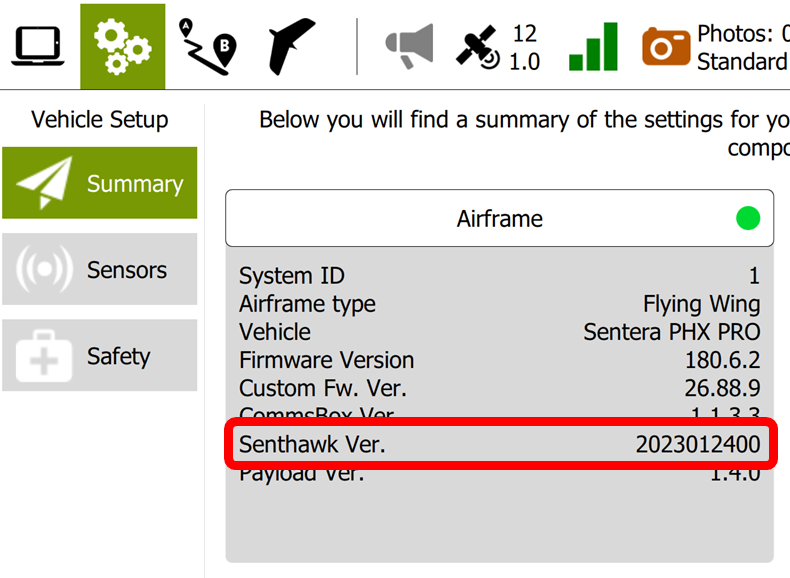

# Formatting Tools

## Header 1

just a regular paragraph.

***

## Cards

<table data-card-size="large" data-view="cards" data-full-width="false"><thead><tr><th></th><th data-type="files"></th><th data-type="content-ref"></th><th data-hidden data-card-cover data-type="files"></th></tr></thead><tbody><tr><td>A card can contain several fields of varying data types. </td><td><a href="../../.gitbook/assets/PHX-Senthawk-2023012400.zip">PHX-Senthawk-2023012400.zip</a></td><td><a href="https://sentera.shop/">https://sentera.shop/</a></td><td><a href="../../.gitbook/assets/NOSHADOW-PHX_Left_01.png">NOSHADOW-PHX_Left_01.png</a></td></tr><tr><td>This one has other stuff </td><td></td><td></td><td></td></tr></tbody></table>

***

## Tabs



<figure><figcaption></figcaption></figure>



<figure><figcaption></figcaption></figure>



<figure><figcaption></figcaption></figure>



* [x] Spar
* [x] Left Wing
* [x] Right Wing
* [x] Battery



***

## Expander

<details>

<summary>I contain more information</summary>

This is where I would put more information, if I had any.&#x20;

.png>)

* The
* Itsy
* Bitsy
* Spider


</details>

***

## Table

| Stuff   | Things | More |
| ------- | :----: | :--: |
| Value 1 |    1   |   A  |
| Value 2 |    2   |   B  |
| Value 3 |    3   |   C  |

***

## Info/Warning


Info



Warning



Do Not



Do it


***

## Quotes

> Four score and seven years ago our fathers brought forth on this continent, a new nation, conceived in Liberty, and dedicated to the proposition that all men are created equal.
>
> Now we are engaged in a great civil war, testing whether that nation, or any nation so conceived and so dedicated, can long endure. We are met on a great battle-field of that war. We have come to dedicate a portion of that field, as a final resting place for those who here gave their lives that that nation might live. It is altogether fitting and proper that we should do this.
>
> But, in a larger sense, we can not dedicate -- we can not consecrate -- we can not hallow -- this ground. The brave men, living and dead, who struggled here, have consecrated it, far above our poor power to add or detract. The world will little note, nor long remember what we say here, but it can never forget what they did here. It is for us the living, rather, to be dedicated here to the unfinished work which they who fought here have thus far so nobly advanced. It is rather for us to be here dedicated to the great task remaining before us -- that from these honored dead we take increased devotion to that cause for which they gave the last full measure of devotion -- that we here highly resolve that these dead shall not have died in vain -- that this nation, under God, shall have a new birth of freedom -- and that government of the people, by the people, for the people, shall not perish from the earth.
>
> Abraham Lincoln\
> November 19, 1863

***

## Code Blocks & APIs

```
// Some code
TransectStyleComplexItem": {
        "CameraCalc": {
            "AdjustedFootprintFrontal": 41.99466666666667,
            "AdjustedFootprintSide": 83.98933333333333,
            "CameraName": "Sentera Double 4K",
            "DistanceToSurface": 121.92,
            "DistanceToSurfaceRelative": true,
            "FixedOrientation": true,
            "FocalLength": 5.4,
            "FrontalOverlap": 60,
            "ImageDensity": 3.4995555555555553,
            "ImageHeight": 3000,
            "ImageWidth": 4000,
            "Landscape": true,
            "MinTriggerInterval": 0.8,
            "SensorHeight": 4.65,
            "SensorWidth": 6.2,
            "SideOverlap": 40,
            "ValueSetIsDistance": true,
            "version": 1
        },
```



API Stuff



I find stuff









***

## Embedded Video





***
